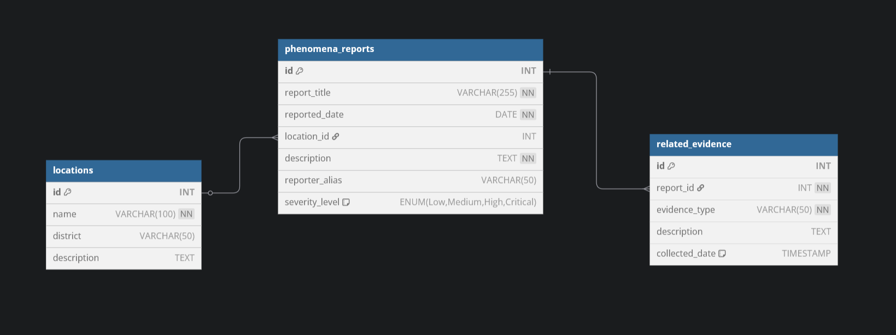
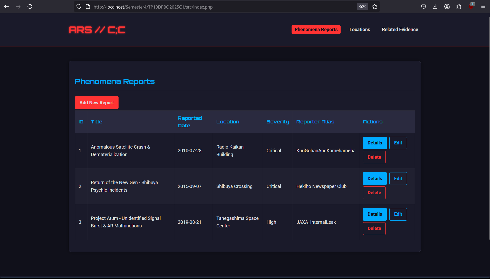
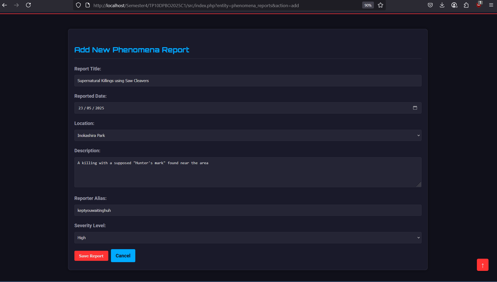
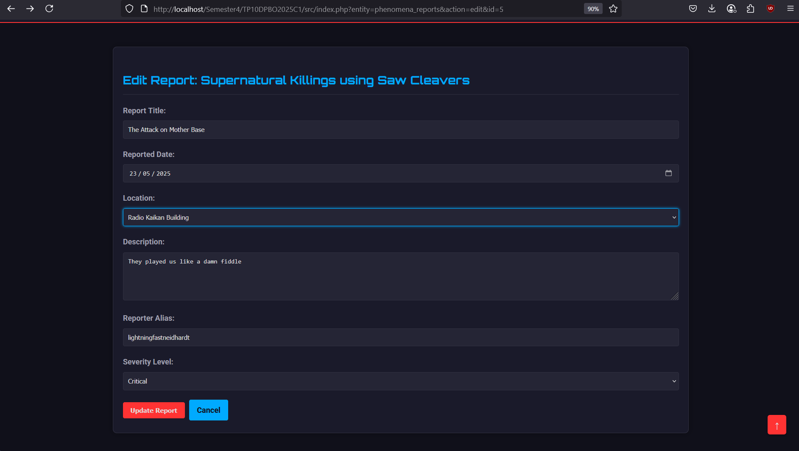
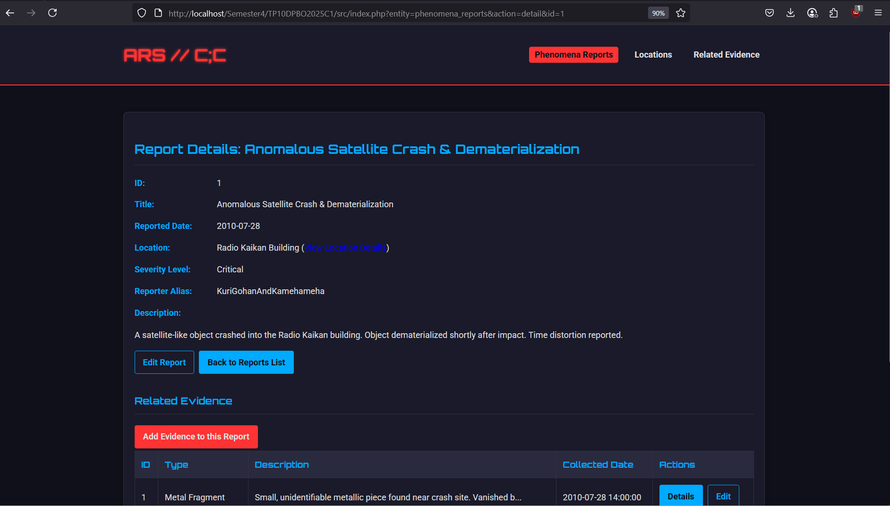
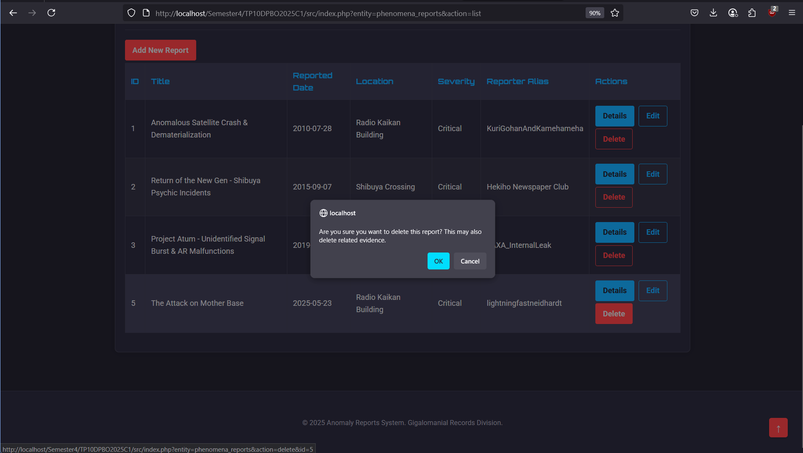
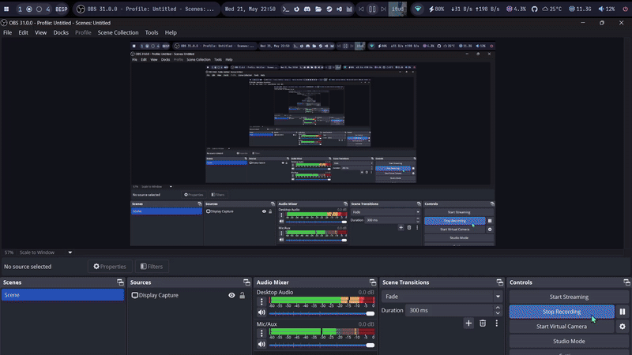

# Sistem Manajemen Laporan Anomali (Anomaly Reporting System)

## Janji

Saya Lyan Nazhabil Dzuquwwa dengan NIM 2308428 mengerjakan Tugas Praktikum 10 dalam mata kuliah Desain dan Pemrograman Berorientasi Objek untuk keberkahanNya maka saya tidak melakukan kecurangan seperti yang telah dispesifikasikan. Aamiin.

## Diagram
Berikut merupakan Diagram Desain dari program (MVVM):

## Desain Program

Program ini mengimplementasikan sistem manajemen data laporan anomali menggunakan pola desain Model-View-ViewModel (MVVM) dengan PHP. Terdapat beberapa kelas utama yang dibagi menjadi komponen Model, View, dan ViewModel:

### Model
Komponen Model bertanggung jawab untuk mengelola data dan logika bisnis terkait data, serta interaksi dengan database.
1.  **[`Location.php`](src/model/Location.php)** - Kelas entitas yang merepresentasikan data sebuah lokasi.
    *   Atribut: `id`, `name`, `district`, `description`.
    *   Method: Constructor, `getAll()`, `getById()`, `create()`, `update()`, `delete()`.
2.  **[`PhenomenaReport.php`](src/model/PhenomenaReport.php)** - Kelas entitas yang merepresentasikan data sebuah laporan fenomena.
    *   Atribut: `id`, `report_title`, `reported_date`, `location_id`, `description`, `reporter_alias`, `severity_level`.
    *   Method: Constructor, `getAll()`, `getById()`, `create()`, `update()`, `delete()`.
3.  **[`RelatedEvidence.php`](src/model/RelatedEvidence.php)** - Kelas entitas yang merepresentasikan data bukti terkait sebuah laporan.
    *   Atribut: `id`, `report_id`, `evidence_type`, `description`, `collected_date`.
    *   Method: Constructor, `getAll()`, `getByReportId()`, `getById()`, `create()`, `update()`, `delete()`.
4.  **[`Database.php`](src/config/Database.php)** - Kelas untuk mengelola koneksi ke database MySQL.
    *   Atribut: `host`, `username`, `password`, `database`, `conn`.
    *   Method: `getConnection()`.

### View
Komponen View bertanggung jawab untuk menampilkan data kepada pengguna dan mengirimkan input pengguna ke ViewModel (melalui controller di `index.php`).
1.  **Daftar Entitas:**
    *   [`locations.php`](src/views/locations.php) - Menampilkan daftar semua lokasi.
    *   [`phenomena_reports.php`](src/views/phenomena_reports.php) - Menampilkan daftar semua laporan fenomena.
    *   [`related_evidence.php`](src/views/related_evidence.php) - Menampilkan daftar semua bukti terkait.
2.  **Form Entitas (Tambah/Edit):**
    *   [`locations_form.php`](src/views/locations_form.php) - Form untuk menambah atau mengubah data lokasi.
    *   [`phenomena_reports_form.php`](src/views/phenomena_reports_form.php) - Form untuk menambah atau mengubah data laporan fenomena.
    *   [`related_evidence_form.php`](src/views/related_evidence_form.php) - Form untuk menambah atau mengubah data bukti terkait.
3.  **Detail Entitas:**
    *   [`locations_detail.php`](src/views/locations_detail.php) - Menampilkan detail data lokasi.
    *   [`phenomena_reports_detail.php`](src/views/phenomena_reports_detail.php) - Menampilkan detail data laporan fenomena beserta bukti terkaitnya.
    *   [`related_evidence_detail.php`](src/views/related_evidence_detail.php) - Menampilkan detail data bukti terkait.
4.  **Template Umum:**
    *   [`header.php`](src/views/template/header.php) - Bagian header halaman HTML, termasuk navigasi.
    *   [`footer.php`](src/views/template/footer.php) - Bagian footer halaman HTML.
    *   [`styles.css`](src/assets/styles.css) - File CSS untuk styling.
    *   [`scripts.js`](src/assets/scripts.js) - File JavaScript untuk fungsionalitas frontend.

### ViewModel
Komponen ViewModel bertindak sebagai perantara antara Model dan View (dikontrol oleh [`index.php`](src/index.php)). ViewModel mengambil data dari Model, memformatnya jika perlu, dan menyediakannya untuk View. ViewModel juga menerima input dari View (melalui controller) dan meneruskannya ke Model untuk operasi data.
1.  **[`LocationViewModel.php`](src/viewmodel/LocationViewModel.php)** - Menangani logika untuk data lokasi.
    *   Method: `getAllLocations()`, `getLocationById()`, `createLocation()`, `updateLocation()`, `deleteLocation()`.
2.  **[`PhenomenaReportViewModel.php`](src/viewmodel/PhenomenaReportViewModel.php)** - Menangani logika untuk data laporan fenomena.
    *   Method: `getAllPhenomenaReports()`, `getPhenomenaReportById()`, `createPhenomenaReport()`, `updatePhenomenaReport()`, `deletePhenomenaReport()`.
3.  **[`RelatedEvidenceViewModel.php`](src/viewmodel/RelatedEvidenceViewModel.php)** - Menangani logika untuk data bukti terkait.
    *   Method: `getAllRelatedEvidence()`, `getRelatedEvidenceByReportId()`, `getRelatedEvidenceById()`, `createRelatedEvidence()`, `updateRelatedEvidence()`, `deleteRelatedEvidence()`.

## Alur Program

Program dimulai dari file [`src/index.php`](src/index.php) yang bertindak sebagai _front controller_ utama. File ini menangani permintaan HTTP berdasarkan parameter `entity` dan `action` pada URL, kemudian memanggil metode yang sesuai pada ViewModel yang relevan, dan akhirnya memuat View yang tepat untuk menampilkan data atau form.

1.  **Menampilkan Halaman Utama/Daftar Laporan Fenomena (Read)**
    Halaman utama (default) menampilkan daftar seluruh laporan fenomena yang ada di database.
    

2.  **Menambah Data Baru (Create)**
    Pengguna dapat menambah data baru (misalnya, Lokasi, Laporan Fenomena, atau Bukti Terkait) dengan mengklik tombol "Add New..." pada halaman daftar masing-masing entitas. Sebuah halaman form akan muncul untuk diisi.
    

3.  **Mengubah Data (Update)**
    Untuk mengubah data yang sudah ada, pengguna dapat mengklik tombol "Edit" pada baris entitas yang diinginkan di halaman daftar. Halaman form akan muncul dengan data yang sudah terisi.
    

4.  **Melihat Detail Data (Read)**
    Pengguna dapat melihat detail informasi dari sebuah entitas dengan mengklik tombol "Details" pada halaman daftar.
    

5.  **Menghapus Data (Delete)**
    Pengguna dapat menghapus data dengan mengklik tombol "Delete" pada baris entitas yang diinginkan di halaman daftar. Sebuah konfirmasi akan muncul sebelum data dihapus.
    

## Skema Database
Struktur tabel database didefinisikan dalam file [`migrations.sql`](src/database/migrations.sql).

## Dokumentasi
Berikut adalah demo singkat dari fungsionalitas website:
